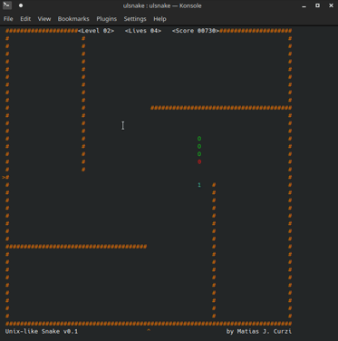

# ulsnake (Unix-like Snake)

A classic Snake game clone written in **pure C** using the `ncurses` library. Originally developed for Windows as a learning project around **2004** and later ported to Unix-like systems.

## 🕹️ Overview

`ulsnake` is a lightweight, terminal-based game where you control a snake, collect numbers to grow, and avoid crashing into walls or your own tail. It was built during an era where documentation was scarce, requiring manual implementation of game logic and terminal management.

As of **2026**, the project remains **fully functional** on modern Linux distributions (tested on Ubuntu 24.04.4 LTS).

<p align="center">
  
</p>

## 🛠️ Technical Features

*   **NCurses Interface:** Uses the `ncurses` library for window management, color pairs, and non-blocking keyboard input (`nodelay`).
*   **Manual Memory Management:** Implements a circular-buffer-style logic to manage the snake's body coordinates, reusing array space to maintain a minimal memory footprint.
*   **Collision Engine:** Uses a coordinate matrix to handle real-time collision detection for walls, the snake's body, and items.
*   **Legacy Portability:** Originally written in the Turbo C++/Borland era and later migrated to ANSI C for modern Unix/Linux distributions.

## 🚀 Installation & Run

To compile and run `ulsnake`, you need the `ncurses` development libraries installed.

**On Debian/Ubuntu:**
   ```bash
   sudo apt install libncurses5-dev libncursesw5-dev
   ```

1. **Clone the repository:**
   ```bash
   git clone https://github.com/mcurzi/ulsnake.git
   cd ulsnake
   ```

2. **Compile using the provided Makefile:**
   ```bash
   make
   ```

3. **Run the game:**
   ```bash
   ./ulsnake

   ```

## 📜 Controls

*   **Arrow Keys / WASD:** Move the snake.
*   **Space / P:** Pause the game.
*   **Enter:** Confirm selection.
*   **Q:** Quit.

---

### 🕹️ Historical Note

This is one of my first projects in C, dating back to 2004. Originally written for Windows as a self-taught experiment after reading the classic K&R book. I later ported it to Linux using `ncurses` to keep the logic alive on modern systems.

The code is far from modern standards, provided 'as-is'.

### 💾 Legacy Version (MS-DOS)
Inside the `dos-legacy` folder, you can find the original 2004 version of the game.
It was written for Borland Turbo C++ and uses DOS-specific headers like `conio.h` and `dos.h`.


