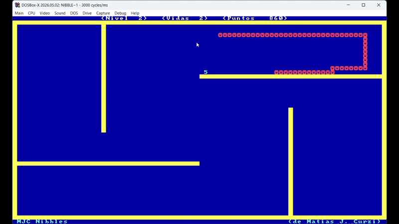

# ulsnake (Unix-like Snake)

A classic Snake game clone written in **pure C** for GNU/Linux. Based on Microsoft's `NIBBLES.BAS`, it was originally written for MS-DOS as a **C** learning project after reading the classic K&R book around **2003-2004**. I later found the code in an old drive and ported it to Linux. Many years later, I found the code again and I'm sharing both versions. The code is far from modern standards, provided 'as-is'.

<p align="center">
  <br>
  
  
</p>

## 🕹️ Overview

`ulsnake` is a lightweight, terminal-based game where you control a snake, collect numbers to grow, and avoid crashing into walls or your own tail. It has 12 different levels increasing in complexity and different speed options. It was built during an era where documentation was scarce, requiring manual implementation of game logic and terminal management.

As of **2026**, the program remains **functional** on modern Linux distributions. It only requires `ncurses` library and a terminal set with at least 50 rows and 80 columns.

Inside the `dos-legacy` folder, you can find the original 2004 version of the game as a standalone file. It compiles with Borland Turbo C++ and runs on MS-DOS and current DOSBox versions.

## 🛠️ Technical Features

*   **NCurses Interface:** Uses the `ncurses` library for window management, color pairs, and non-blocking keyboard input (`nodelay`).
*   **Manual Memory Management:** Implements a circular-buffer-style logic to manage the snake's body coordinates, reusing array space to maintain a minimal memory footprint.
*   **Collision Engine:** Uses a coordinate matrix to handle real-time collision detection for walls, the snake's body, and items.

## 🚀 Installation & Run

To compile and run `ulsnake`, you need the `ncurses` development libraries installed.

**On Debian/Ubuntu:**
   ```bash
   sudo apt install libncurses5-dev libncursesw5-dev
   ```

1. **Downdoad or clone the repository.**

2. **Access the main uslnake folder through the command line and compile using the provided Makefile:**
   ```bash
   cd PATH_TO/ulsnake
   make
   ```

3. **Run the game:**
   ```bash
   ./ulsnake

   ```

## 📜 Controls

*   **Arrow Keys / WASD:** Move the snake.
*   **Space / P:** Pause the game.
*   **Enter:** Confirm selection.
*   **Q:** Quit.

---
